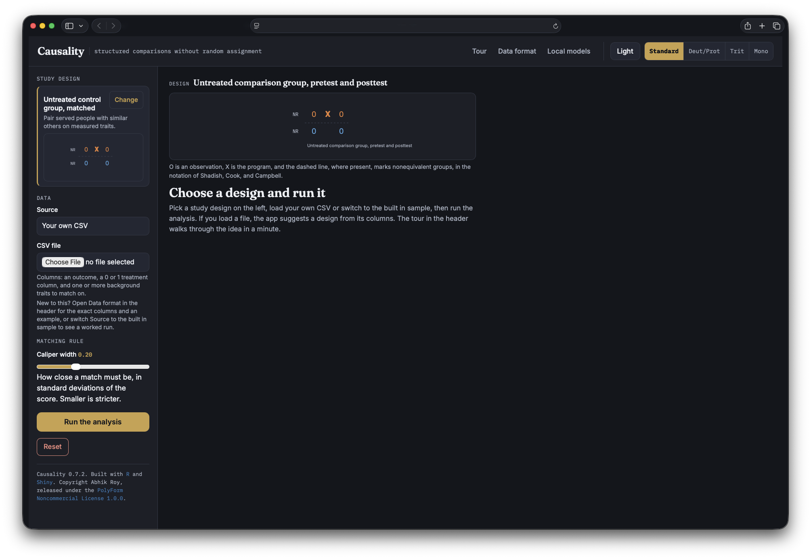

# Causality

Structured comparisons without random assignment.

Causality is a workbench for quasi-experimental analysis, written in R and Shiny.
It answers one kind of question: did a program, a policy, or a change actually
cause a difference in some outcome, rather than merely moving alongside it. A
plain comparison tells you what happened to the people who got the thing. The
honest question is what would have happened to those same people if they had not,
and every design here is a way to stand in for that missing half.

The app runs entirely on your machine. Nothing is uploaded, and every statistic is
computed locally by code you can read.



## Eight designs, grouped as the standard text groups them

The designs, their names, and their notation follow Shadish, Cook, and Campbell,
*Experimental and Quasi-Experimental Designs for Generalized Causal Inference*.
Notation reads left to right in time: **O** is an observation, **X** is the
treatment, and a dashed rule between two rows marks groups that were not formed
by random assignment.

**Without a control group.** One group posttest only (`X O`) and one group
pretest posttest (`O X O`). Neither identifies an effect. The app runs them
anyway, reports what the data hold, and states plainly what is missing, which is
the reason the text keeps them.

**Control group, no pretest.** Posttest only with nonequivalent groups. The gap
between groups is reported with the warning that selection sits inside it.

**Control group and pretest.** Matched comparison by propensity score with an
adjustable caliper, a balance table, a common support plot, a Love plot, and
Rosenbaum sensitivity bounds. Untreated control over time by difference in
differences, with a parallel trends test, a placebo period, and an event study.

**Interrupted time series.** Segmented regression on a single series, reporting
the immediate change in level and any change in trend against the earlier trend
carried forward.

**Regression discontinuity.** Local linear fit on each side of a cutoff with a
triangular kernel, reading the vertical gap at the threshold as the effect.

**Instrumental variables.** Two stage least squares with the first stage F
statistic gated at ten, so a weak instrument is flagged rather than reported as
though it were sound.

## What the app does with a result

Every result leads with the plain comparison crossed out beside the adjusted
estimate. The distance between them is the confounding the design removed, shown
rather than asserted.

Every result also carries an identification check: the one assumption its design
leans on hardest, tested and shown beside the estimate. Balance for matching,
parallel trends for difference in differences, series length for time series,
sorting at the cutoff for discontinuity, instrument strength for instrumental
variables, and for the three weak designs, a plain statement that nothing is
identified. An effect never appears without the state of the check that licenses
it.

Where a reshuffle is fast and clean, a placebo refutation is one click away.
Assignment is scrambled two hundred times, the design re estimated on each, and
the share of placebo runs that rival the real effect reported as a permutation
style p value.

Every result exports two files: a written summary, and a standalone R script that
reruns the analysis in plain base R so the pipeline leaves the app reproducible.

## Running it

Causality needs R 4.1 or later with `shiny`, `dplyr`, `tidyr`, `purrr`, `readr`,
`tibble`, and `jsonlite`. The optional local model layer also uses `httr`, and
the app runs without it.

```r
install.packages(c("shiny", "dplyr", "tidyr", "purrr", "readr", "tibble",
                   "jsonlite"))
```

From the project folder:

```r
shiny::runApp(".", launch.browser = TRUE)
```

Each design ships with a built in sample carrying a known true effect, so you can
check the arithmetic against a fixed answer. The same samples are in `data/` as
CSV files, one per design, ready to load through the upload path.

To study your own data, choose **Your own CSV**, which is the default. The app
inspects the columns and suggests a design, naming its reasoning. The suggestion
never locks anything: the chooser lists all eight designs under the group headings
above, and changing it is one click. The **Data format** button in the header
gives the exact columns and a worked example row for every design.

## The local model, and what it may do

Every statistic and every sentence of the analysis is computed by the app on your
machine. An optional local language model can restate a finished result in plainer
words, and even that runs locally through Ollama. The model receives the completed
sentences and is asked only to smooth them. It cannot produce a number, change a
number, or add a finding. If no model is running, the app shows the computed prose
unchanged. The **Local models** button explains how to set one up.

## Accessibility

Dark mode is the default, with a light mode and four color settings covering
standard vision, deuteranopia and protanopia, tritanopia, and monochrome. Every
text and surface pairing clears WCAG 2.2 contrast at 4.5 to 1 across all eight
theme and palette combinations, and the test suite rechecks this so a later edit
that breaks a token fails the build. Group identity rides on shape as well as
color, so no encoding rests on color alone. Interactive targets meet the 44 pixel
minimum, keyboard focus stays visible, and reduced motion is honored.

## Tests

```
Rscript tests/run_tests.R
```

Five suites run: the estimator checks, which confirm each design recovers a
planted effect and each weak design refuses to identify one; a contrast audit
across all eight theme and palette combinations; writing sweeps over the source
and the generated prose; browser checks that drive the tour, the appearance
controls, and every notation diagram in a real DOM; and a live boot of the app.

The browser suite needs `jsdom`:

```
cd tests && npm install && cd ..
```

## Layout

```
app.R                 interface, server, and the inline browser code
R/causal_math.R       estimators, detection, and wire formats
R/interpret.R         plain language readings, caveats, identification checks
R/samples.R           the built in samples, one per design
R/refute.R            placebo refutation
www/app.css           design system, themes, and color settings
www/notation.js       design notation diagrams
www/plots.js          the figures, built as SVG by hand
data/                 example CSVs, one per design
docs/                 screenshots used by the README
tests/                the five suites
```

## Contributing

Issues and pull requests are welcome. [CONTRIBUTING.md](CONTRIBUTING.md) covers
the test gate, the writing and accessibility conventions the sweeps enforce, and
the full checklist for adding a study design.

## Changes

Release history is in [CHANGELOG.md](CHANGELOG.md).

## Citing

If this software supports published work, please cite it. GitHub reads
[CITATION.cff](CITATION.cff) and offers a formatted citation from the sidebar of
the repository page.

## Scope

Estimators here are written by hand in base R and dplyr rather than pulled from
specialist packages, so every number traces to readable code and the app stays
self contained. A fuller platform, with a drawing based DAG engine, causal machine
learning, synthetic controls, staggered adoption event studies, and package backed
clustered variance estimators, is a natural extension and is not part of this
build.

## License

PolyForm Noncommercial License 1.0.0. See [LICENSE.md](LICENSE.md).

Required Notice: Copyright Abhik Roy
